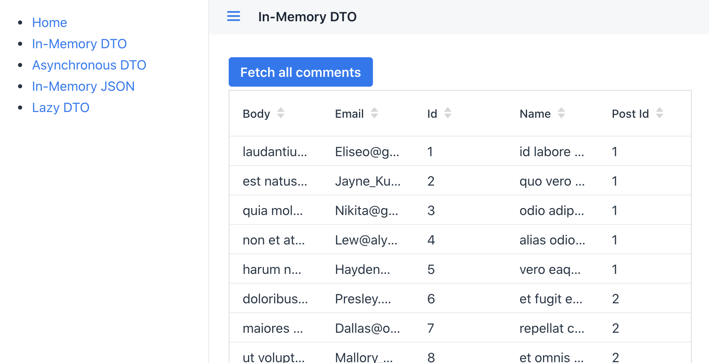

# Example app for using REST services with Vaadin and Spring Boot

This example application demonstrates three ways of connecting your Vaadin and Spring Boot application to a REST backend. The examples are

1) Using a DTO class to fetch and display all results from a REST API
2) Using dynamic JSON to fetch and display all results from a REST API
3) Calling REST services asynchronously
4) Using a DTO class to lazily fetch and display data from REST on demand

The main class of this app is com.vaadin.example.rest.ui.MainView, where we create our three demos. The UI class uses DTOs and a Spring service located in the com.vaadin.example.rest.data package.

The backend.restprovider package is not part of the demo; it is an implementation of a 3rd party REST API so that we don't need to depend on an actual one. The classes provide a REST API running on localhost, with two API methods, 'count' and 'data'.

## Running the Application

Import the project to the IDE of your choosing as a Maven project.

Run the application using `mvn spring-boot:run` or by running the `Application` class directly from your IDE.

Open http://localhost:8080/ in your browser.

If you want to run the application locally in the production mode, run `mvn spring-boot:run -Pproduction`.

## More Information

- [Vaadin documentation](https://vaadin.com/docs)
- [Using Vaadin and Spring](https://vaadin.com/docs/v14/flow/spring/tutorial-spring-basic.html) article

